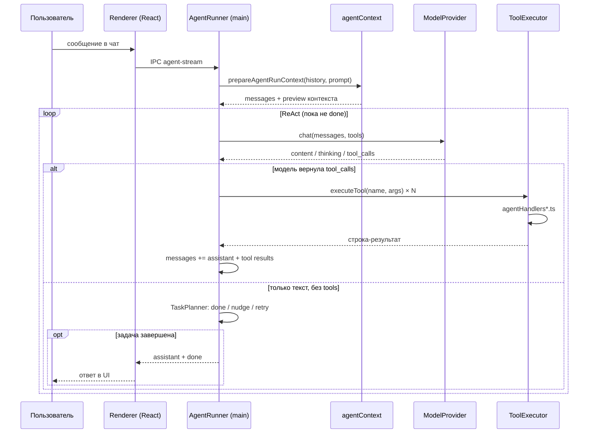

# Участие в разработке CodeViper

Рады любому вкладу — баг-фиксам, новым функциям, улучшениям документации.

## Быстрый старт для разработки

```powershell
git clone https://github.com/rkfsociety/CodeViper.git
cd CodeViper/app
npm install
npm run dev        # Запуск в режиме разработки (hot reload)
```

В режиме разработки открывается Electron-окно с DevTools.

## Структура проекта

```
app/
├── electron/
│   ├── main/          # Main process (Node.js)
│   │   ├── agent.ts           # Основной цикл агента (ReAct)
│   │   ├── agentContext.ts    # Построение контекста для LLM
│   │   ├── agentHandlers*.ts  # Обработчики инструментов агента
│   │   ├── providers/         # Провайдеры моделей (Ollama, OpenAI, …)
│   │   ├── settings.ts        # Загрузка/сохранение настроек
│   │   └── index.ts           # Точка входа Electron
│   └── preload/       # Preload-скрипт (IPC-мост)
├── src/               # Renderer process (React)
│   ├── components/    # UI-компоненты
│   ├── contexts/      # React Context (Agent, Chat, Queue)
│   └── hooks/         # Хуки
└── shared/            # Общий код (типы, утилиты; без Node.js API)
```

## Архитектура агента (ReAct)

Агент работает в **main process** (`AgentRunner` в `agent.ts`). Renderer только отправляет промпт и отображает стрим событий через IPC (`agent-stream`). Весь доступ к файлам, git и shell — только в main.

### Ключевые модули

| Модуль | Файл | Роль |
|--------|------|------|
| Цикл ReAct | `agent.ts` | `while`-цикл: запрос к модели → tool calls → результаты в историю → повтор |
| Контекст | `agentContext.ts` | Системный промпт, RAG, суммаризация истории, список инструментов |
| Менеджер контекста | `agentContextManager.ts` | Вызов провайдера, учёт токенов, circuit breaker |
| Исполнитель инструментов | `agentToolExecutor.ts` | Роутинг вызовов, параллельные read-only tools, подтверждения |
| Схемы инструментов | `agentTools.ts` | JSON Schema для ~70 встроенных tools + MCP + плагины |
| Обработчики | `agentHandlers*.ts` | Реализация по группам: project, gitHub, memory, skills, … |
| Провайдеры | `providers/*.ts`, `modelRuntime.ts` | Ollama, OpenAI, Claude, Gemini; стрим `ChatChunk` |
| Верификация | `shared/actionVerification.ts` | `MUTATING_TOOLS`, nudge «нужен tool call» |
| Парсинг tools | `shared/toolCalls.ts` | `AGENT_TOOL_NAMES`, text-based tool calls от Ollama |
| Настройки | `settings.ts` | Zod-схема `PersistedSettingsSchema` |

### Диаграмма цикла ReAct



Типичный сценарий «найди баг и исправь»: `read_file` → `grep_files` → `edit_file` → `run_command` (тесты) — несколько итераций одного цикла.

## Перед отправкой PR

```powershell
cd app
npm run typecheck   # Проверка типов TypeScript
npm run build       # Сборка (папка out/ должна быть актуальной)
```

Коммиты на русском языке, в формате `тип: описание` (`fix:`, `feat:`, `perf:`, `docs:`).

## Как добавить нового провайдера модели

1. Создайте `app/electron/main/providers/myProvider.ts`, реализовав интерфейс `ModelProvider`
2. Зарегистрируйте в `modelRuntime.ts`
3. Добавьте пункт в `SettingsModal.tsx` (выбор провайдера)
4. Добавьте поле API-ключа в `types.ts` и `settings.ts`

Пример: смотрите `openaiProvider.ts` — он же используется для DeepSeek и OpenRouter.

Метод `chat()` должен возвращать `AsyncGenerator<ChatChunk>` с полями `content`, `thinking`, `stop_reason`, `tool_calls` (без `.type` / `.text`).

## Как добавить инструмент агента

Пошаговый гайд на примере read-only инструмента `project_stats` (сводка по проекту).

### Шаг 1. Схема в `agentTools.ts`

Добавьте объект в массив `FILE_TOOLS` (или в подходящую группу):

```typescript
{
  type: 'function',
  function: {
    name: 'project_stats',
    description: 'Краткая сводка по проекту: число файлов и папок, …',
    parameters: {
      type: 'object',
      properties: {
        path: { type: 'string', description: 'Подпапка проекта (необязательно)' }
      }
    }
  }
}
```

При необходимости допишите тип аргументов в интерфейсе `ToolArgs` в том же файле.

### Шаг 2. Имя в `shared/toolCalls.ts`

Добавьте `'project_stats'` в массив `AGENT_TOOL_NAMES`. Без этого Ollama не распознает text-based tool calls с этим именем.

### Шаг 3. Обработчик в `agentHandlersProject.ts`

Внутри `createProjectToolHandlers()` добавьте метод в объект `handlers`:

```typescript
project_stats: async (args) => {
  assertInsideProject(args.path, 'папка', { allowEmpty: true })
  const target = args.path?.trim() || projectPath
  // … логика …
  return 'текстовый результат для модели'
}
```

Обработчик всегда возвращает **строку** (ошибки — тоже строкой, не `throw`, если можно обработать локально).

### Шаг 4. Регистрация в `agentToolExecutor.ts`

Если обработчик добавлен в существующую фабрику (`createProjectToolHandlers`, `createMemoryToolHandlers`, …), отдельная регистрация не нужна — `getToolHandlers()` уже мержит все группы.

Новая группа инструментов:

1. Создайте `agentHandlersMy.ts` с `export function createMyToolHandlers(): Partial<ToolHandlers>`
2. Разверните в `getToolHandlers()` в `agentToolExecutor.ts`: `...createMyToolHandlers()`

### Шаг 5. Мутирующие инструменты (при необходимости)

Если инструмент меняет файлы, git, память или запускает команды — добавьте имя в `MUTATING_TOOLS` в `shared/actionVerification.ts`. Это включает:

- чекпоинт прогона (`git stash`) перед выполнением;
- запрос подтверждения в режиме `ask`;
- учёт в верификации «задача требует действий».

Read-only tools (`read_file`, `grep_files`, `project_stats`) в `MUTATING_TOOLS` **не** добавляют.

### Шаг 6. Проверка

```powershell
cd app
npm run typecheck
npm run test -- tests/shared.test.ts   # AGENT_TOOL_NAMES, MUTATING_TOOLS
npm run build
```

В UI: промпт, который явно требует новый инструмент, и просмотр trace в DevTools (события `tool_call` / `tool_result`).

### Чеклист нового инструмента

| # | Действие | Файл |
|---|----------|------|
| 1 | JSON Schema + описание | `agentTools.ts` |
| 2 | Имя в списке парсера | `shared/toolCalls.ts` → `AGENT_TOOL_NAMES` |
| 3 | `async (args) => string` | `agentHandlers*.ts` |
| 4 | Подключение фабрики | `agentToolExecutor.ts` → `getToolHandlers()` |
| 5 | Если мутирует данные | `shared/actionVerification.ts` → `MUTATING_TOOLS` |
| 6 | typecheck + build | `app/` |

## Вопросы

Пишите в [Discussions](https://github.com/rkfsociety/CodeViper/discussions) или создавайте [Issue](https://github.com/rkfsociety/CodeViper/issues/new/choose) — есть шаблоны: баг, предложение, вопрос, документация.
