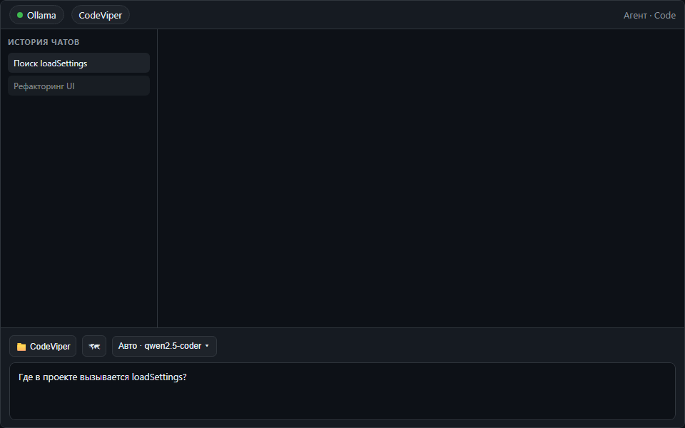
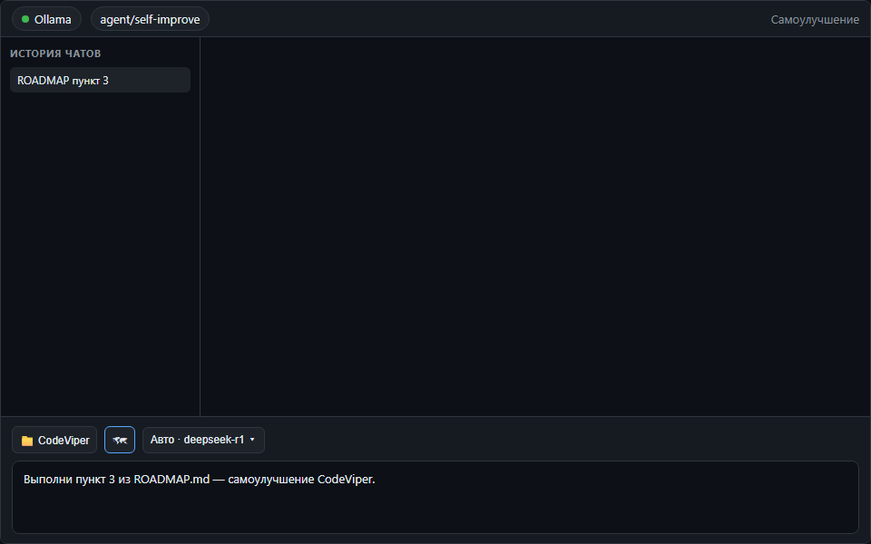
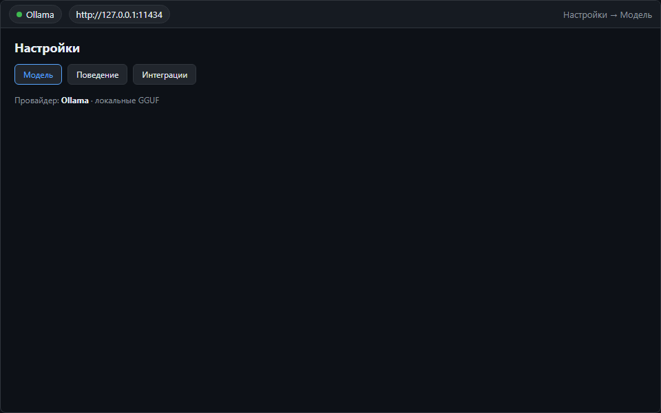

# Демонстрации

> GIF хранятся в репозитории (`docs/media/`). Общая документация — [вики](https://github.com/rkfsociety/CodeViper/wiki).

Короткие GIF типичных сценариев CodeViper.

| Поиск по коду | Самоулучшение | Ollama |
| :---: | :---: | :---: |
|  |  |  |
| `grep_files` → `read_file` → ответ | ROADMAP → план → коммит в `agent/self-improve` | Список моделей и скачивание |

Назад в [README](../README.md).

## Перегенерация GIF

```bash
cd app && npm run capture:readme-media
```

Исходники макетов: `docs/media/source/`. Параметры скорости — в `scripts/capture-readme-media.mjs`.
